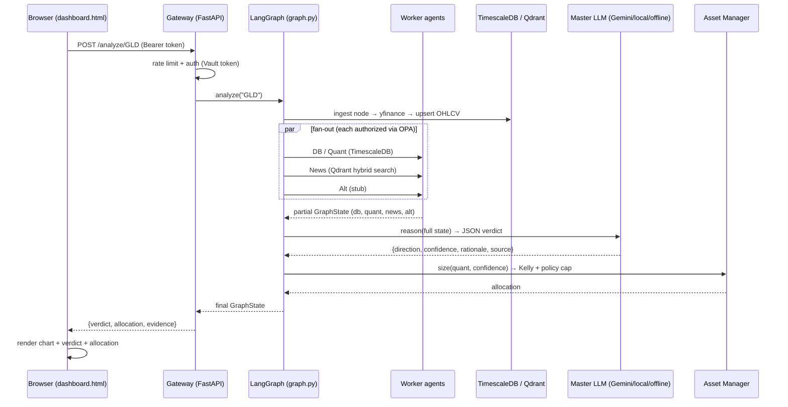

# ArthaAI — Engineer Handoff & End-to-End Flow

This document is for the engineer taking over ArthaAI. It explains **exactly what
happens, step by step, when a user enters a ticker (e.g. `GLD`) and presses
Analyze** — through every file, function, service, and data store — followed by
the reference material you need to run, extend, and reason about the system.

- **Branch:** `feat/arthaai-core` (not merged to `main` yet)
- **Architecture blueprint (the "why"):** [arthaai-architecture.html](arthaai-architecture.html) — open in a browser
- **User-facing README (setup + provider chain):** [README.md](README.md)
- **Language/stack:** Python 3.12, FastAPI, LangGraph, TimescaleDB, Qdrant, OPA, Vault, Redpanda (Kafka)

> ⚠️ **Local machine note:** this Mac runs an **x86_64 (Rosetta) shell** (Homebrew is under `/usr/local`).
> The venv is built x86_64 to match. Always run through the Makefile (`make …`) or prefix with
> `arch -x86_64`, e.g. `arch -x86_64 .venv/bin/python -m arthaai.cli analyze GLD`. Plain `python` from
> an arm64 context will fail with an "incompatible architecture" import error.

---

## 1. The 10,000-ft picture

Four tiers (from the blueprint), all runnable locally:

```
Tier 1  Client & Interface     → FastAPI gateway + browser dashboard      (arthaai/gateway/)
Tier 2  Orchestration & Data    → LangGraph graph, 4 worker agents,        (arthaai/orchestration/, agents/, db/)
                                   Master LLM, TimescaleDB, Qdrant, Kafka
Tier 3  Oversight & Asset Mgmt   → Asset Manager (Kelly sizing + policy)    (arthaai/agents/asset_manager.py)
Tier 4  Execution               → paper execution w/ guardrails             (arthaai/execution/)
```

**The golden rule of the codebase:** the *deterministic quant layer* computes every
number (indicators, statistics, Kelly). The *LLM only explains/synthesises* — it
never invents a number that drives a trade. Keep that boundary.

---

## 2. Step-by-step: "type GLD → press Analyze"

Below is the full trace. Each step names the **file → function** that runs.

### Phase A — Browser (Tier 1 UI)

**A1. Page load.** Browser hits `GET /` →
[`arthaai/gateway/app.py`](arthaai/gateway/app.py) `dashboard()`. The gateway reads
[`arthaai/gateway/static/dashboard.html`](arthaai/gateway/static/dashboard.html) and
**injects a valid bearer token** in place of `__ARTHAAI_TOKEN__` (token comes from
Vault, env fallback). The user never types a credential.

**A2. Initial chart.** On load, the page JS calls `GET /ohlcv/GLD` → `ohlcv()` in
`app.py`, which reads recent bars from TimescaleDB (ingesting on demand if empty)
and draws the candlestick chart on a `<canvas>`.

**A3. Click Analyze.** JS `analyze()` (in `dashboard.html`) normalizes the symbol
(strips stray dots/spaces) and sends:
```
POST /analyze/GLD
Authorization: Bearer <injected-token>
```
(Note: **no** `skip_ingest` — the UI fetches data on demand so any ticker works.)

### Phase B — Gateway (Tier 1 server)

**B1. Rate limit.** `@limiter.limit("10/minute")` (slowapi) throttles abusive callers.

**B2. Authentication.** The `require_principal` dependency
([`arthaai/gateway/auth.py`](arthaai/gateway/auth.py)) reads the bearer token and
compares it to the expected token from **Vault** (`security/vault.py`, env fallback).
Missing/invalid → `401`/`403`. Valid → a `Principal` is returned.

**B3. Dispatch.** `analyze()` in `app.py` calls
`orchestration.analyze("GLD", skip_ingest=False)`.

### Phase C — Orchestration (Tier 2, LangGraph)

**C1. Build & invoke graph.**
[`arthaai/orchestration/graph.py`](arthaai/orchestration/graph.py) `analyze()`
normalizes the symbol and calls `build_graph().invoke({symbol, skip_ingest})`.
The shared state object is `GraphState`
([`orchestration/state.py`](arthaai/orchestration/state.py)) — every node reads and
appends to it.

**C2. `ingest` node** (`_ingest` → [`data/ingest.py`](arthaai/data/ingest.py) `ingest()`):
  1. `ensure_asset("GLD")` — registers the symbol in the `assets` table (so the OHLCV
     foreign key is satisfied); best-effort name/type from yfinance.
  2. Downloads ~2 years of daily OHLCV from **yfinance**.
  3. `upsert_ohlcv(...)` writes bars into the **TimescaleDB** `ohlcv` hypertable
     ([`db/timescale.py`](arthaai/db/timescale.py)).
  4. Publishes a best-effort event to the **Kafka/Redpanda** bus (never blocks).

**C3. Fan-out to 4 worker agents** (LangGraph runs these concurrently). **Before any
agent touches a tool, it calls `authorize_tool()`** — which asks the live **OPA**
server whether that agent's SPIFFE identity may use that tool (policy in
[`policy/arthaai.rego`](policy/arthaai.rego)); if OPA is down it falls back to the
in-process least-privilege map. See [`security/`](arthaai/security/).

  - **DB_Agent** ([`agents/db_agent.py`](arthaai/agents/db_agent.py)): loads OHLCV
    from Timescale, computes deterministic indicators (SMA20/50, RSI14, trend) via
    [`agents/indicators.py`](arthaai/agents/indicators.py). → `state["db"]`
  - **Quant Agent** ([`agents/quant_agent.py`](arthaai/agents/quant_agent.py)):
    annualised return `μ`, variance `σ²`, volatility `σ`, win-prob `W`, win/loss
    ratio `R`. → `state["quant"]`
  - **News_Agent** ([`agents/news_agent.py`](arthaai/agents/news_agent.py)): queries
    **Qdrant** with **hybrid search** (hard ticker filter → vector similarity) for
    sentiment ([`db/qdrant.py`](arthaai/db/qdrant.py)); wrapped in a **circuit
    breaker** with a neutral fallback. → `state["news"]`
  - **Alt_Agent** ([`agents/alt_agent.py`](arthaai/agents/alt_agent.py)): physical/
    satellite signal. **STUB** — synthetic value for commodity ETFs, abstains for
    equities (real feeds Kpler/Ursa are paid). → `state["alt"]`

**C4. Converge → Master Reasoning LLM** (`_master` →
[`agents/master_llm.py`](arthaai/agents/master_llm.py) `reason()`). This is the
"Brain". It walks the **provider chain** from `ARTHAAI_LLM_CHAIN` (e.g.
`gemini,local,offline`), each provider **circuit-breaker guarded**:
  - `gemini` → REST call to Google (`x-goog-api-key` header, model
    `gemini-2.5-flash`, thinking disabled), key from Vault/env.
  - `local` → any OpenAI-compatible endpoint (Ollama/LM Studio/vLLM).
  - `anthropic` → Claude.
  - `offline` → deterministic weighted-evidence reasoner (always succeeds).

  It feeds the **whole GraphState** (db+quant+news+alt) to the model, which returns
  JSON `{direction, confidence, rationale}` — the rationale must end with
  "I choose this because…". Parsed leniently into a `Verdict`. → `state["verdict"]`
  (the `source` field records which provider actually answered).

**C5. Asset Manager** (`_asset_manager` →
[`agents/asset_manager.py`](arthaai/agents/asset_manager.py) `size()`), Tier 3:
  - **Discrete Kelly** `f = W − (1−W)/R` and **Continuous Kelly** `f* = (μ−r)/σ²`.
  - Applies **quarter-Kelly** scaling (smooths drawdowns), clamps negatives to 0
    (no shorting), then enforces the **deterministic policy cap** (`max 5%` single
    instrument) — the cap always overrides the model. → `state["allocation"]`

**C6. END.** The final `GraphState` returns up to the gateway.

### Phase D — Response & render

**D1. Gateway response.** `analyze()` packages `AnalyzeResponse`
`{symbol, verdict, allocation, evidence:{db,quant,news,alt}}` as JSON.

**D2. Browser render.** `analyze()` JS:
  - If `evidence.db.available` is false → shows **"No market data for GLD"** (dead/invalid ticker).
  - Else reloads the chart and renders: the **verdict** panel (colored by direction),
    the **Kelly allocation** panel, and an **evidence** table (trend, μ/σ, sentiment,
    physical). The `source` line tells you which LLM answered.

### The same flow as a sequence diagram



### The CLI path (same engine, no browser)

`arthaai analyze GLD` → [`arthaai/cli.py`](arthaai/cli.py) `analyze()` calls the
**same** `orchestration.analyze()` (Phase C onward). The gateway is just an HTTP
wrapper; the CLI hits the orchestrator directly. Useful for debugging without the UI.

---

## 3. Services & data stores

Started by `docker compose up -d` ([`docker-compose.yml`](docker-compose.yml)):

| Service | Port | Role | Where used |
|---|---|---|---|
| TimescaleDB | 5432 | OHLCV hypertable + `assets` catalog | `db/timescale.py`, schema `db/schema.sql` |
| Qdrant | 6333 | News/sentiment vectors (hybrid search) | `db/qdrant.py` |
| Redpanda (Kafka) | 9092 | Ingestion event bus | `data/ingest.py` (producer), `data/consumer.py` |
| OPA | 8181 | Policy-as-code, per tool call | `security/opa.py`, `policy/arthaai.rego` |
| Vault | 8200 | Secrets (gateway token, LLM keys) | `security/vault.py` |

**Schema** ([`db/schema.sql`](arthaai/db/schema.sql)): `assets` (symbol, name,
asset_class) + `ohlcv` hypertable (7-day chunks, `TIMESTAMPTZ`). Applied
automatically on first TimescaleDB start.

---

## 4. Configuration (all env-driven)

[`arthaai/config.py`](arthaai/config.py) — `Settings` (pydantic-settings, prefix
`ARTHAAI_`). `.env` is loaded via python-dotenv so unprefixed secrets
(`GEMINI_API_KEY`, `ANTHROPIC_API_KEY`) are visible. Copy `.env.example` → `.env`.

Key knobs:
- `ARTHAAI_LLM_CHAIN` — provider order, e.g. `gemini,local,offline`.
- `GEMINI_API_KEY` / `ARTHAAI_GEMINI_MODEL` (`gemini-2.5-flash`).
- `ARTHAAI_LOCAL_BASE_URL` / `ARTHAAI_LOCAL_MODEL` (Ollama etc.).
- `ARTHAAI_KELLY_FRACTION` (0.25), `ARTHAAI_MAX_SINGLE_INSTRUMENT` (0.05), `ARTHAAI_RISK_FREE_RATE`.
- `ARTHAAI_GATEWAY_TOKEN` — UI/API bearer token (Vault preferred via `arthaai seed-secrets`).

Check provider health any time: `make llm-status`.

---

## 5. Run it

```bash
make setup              # x86_64 venv + install
cp .env.example .env    # add GEMINI_API_KEY / set ARTHAAI_LLM_CHAIN
make up                 # 5 docker services
make seed               # illustrative news into Qdrant
make analyze SYM=GLD    # full pipeline (CLI)
make serve              # gateway + UI at http://localhost:8000/
make test               # 27 tests
```

Other commands: `arthaai universe sync` (register ~12.5k US symbols),
`arthaai backtest GLD` (walk-forward, look-ahead guarded), `arthaai execute GLD`
(paper order through Tier 4 guardrails), `arthaai llm-status`.

---

## 6. What's real vs stubbed (be honest with stakeholders)

| Component | Status |
|---|---|
| Tiers 1–4 end-to-end, LangGraph, 4 agents, Master LLM chain, Kelly+cap | ✅ runs |
| TimescaleDB, Qdrant, live OPA, live Vault, Redpanda | ✅ runs |
| Backtest, dynamic universe, paper execution, UI, 27 tests | ✅ runs |
| **Alt_Agent** physical feeds (Kpler/Vortexa/Kayrros/Ursa) | ○ **stub** — paid data |
| **SPIFFE/SPIRE identity, mTLS, Kubernetes micro-segmentation** | ○ **ops infra** — seams in code, not deployed |
| Bulk price backfill for the whole universe | ○ intentionally not done — needs paid bulk data |

---

## 7. Known gaps & sensible next steps

1. **Signal has no proven edge yet.** `arthaai backtest GLD` shows the naive SMA
   signal *underperforms* buy-and-hold. **This is the most important work:** improve
   the deterministic signal until the backtest shows positive out-of-sample edge.
   The LLM explains; the numbers must have edge. Don't wire real money before this.
2. **News is seed data.** [`data/seed_news.py`](arthaai/data/seed_news.py) loads a
   handful of illustrative articles. Replace with a real feed (RSS/NewsAPI) + a real
   embedding model (`fastembed` extra) for meaningful sentiment.
3. **First analysis of a new ticker is slow** (live yfinance download). Consider a
   background warm-up / caching for a watchlist.
4. **Security is dev-grade.** Vault is dev-mode, OPA has no TLS, gateway token is
   simple. Harden before any shared deployment (that's the SPIRE/mTLS/k8s work).
5. **Rotate the Gemini key** if it was ever printed in logs during setup.

---

## 8. Repository map

```
arthaai/
  config.py            env-driven settings + LLM chain resolution
  cli.py               Typer CLI (analyze, backtest, execute, serve, universe, llm-status, …)
  gateway/             Tier 1: FastAPI app, auth seam, dashboard UI
  orchestration/       Tier 2: LangGraph graph + GraphState
  agents/              worker agents + indicators + master_llm + asset_manager
  db/                  TimescaleDB + Qdrant clients, schema.sql
  data/                ingest (yfinance), seed_news, universe, kafka consumer
  resiliency/          circuit breaker (pybreaker)
  security/            OPA client, Vault client, policy (SPIFFE identity + authorize_tool)
  execution/           Tier 4 paper execution engine + guardrails
policy/arthaai.rego    OPA policy (per-agent tool scopes)
docker-compose.yml     5 services
tests/                 27 tests (kelly, indicators, policy, execution, gateway, backtest, llm)
```

Questions on any step above map directly to a file — start there.
